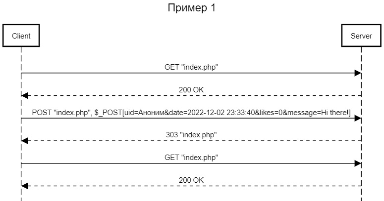

# Отчет по лабораторной работе №2 
## "Реализация шаблона CRUD"
## по курсу "Основы программирования"
### *Работу выполнил студент группы №3131 Федоров Григорий*

#### Цель работы:
 Разработать и реализовать клиент-серверную информационную систему, реализующую механизм CRUD.

#### Пользовательский интерфейс (diagrams.net):

* Форма для того, чтобы оставить запись:

* Запись после публикации: 

#### Пользовательские сценарии работы:

1. Пользователь вводит  какое-либо сообщение или запись в главную форму. Нажав на кнопку запись будет опубликована. 

2. Пользователь может нажать на кнопку лайка или дизлайка, страница обновится и выведется новое их количество на определенной записи.

#### API сервера и хореография:

#### Структура базы данных:

База данных состоит из 5 полей: "id" типа int с автоувеличением для выдачи уникальных id всем сообщениям;
"timestamp" типа datetime для хранения даты и времени отправления сообщения;
"message" типа text для хранения сообщений;
"likes" типа int для хранения количества лайков;
"dislikes" типа int для хранения количества дизлайков.

#### Алгоритмы работы: 

* Алгоритм работы для формы добавления записи:

* Алгоритм работы для лайков или дизлайков:

                                 

